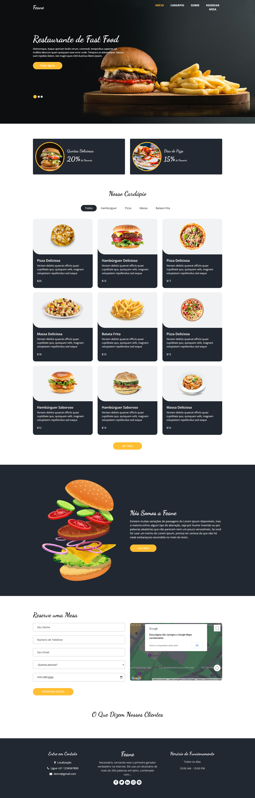

<h2>Sobre o projeto</h2>

<b>Saboreie a rapidez e o sabor 🍔🔥. Este site oferece uma experiência dinâmica para os amantes de fast food, com uma interface intuitiva e recursos práticos. O objetivo é proporcionar uma plataforma ágil e eficiente, com navegação simples, design responsivo e foco no conforto do usuário, garantindo uma jornada de pedidos fácil e rápida. 🍟🥤💻</b>

## 👉 Visualizar Site: <a href='https://feane-zeta.vercel.app/'>Ver Site</a>

### » Tecnologias utilizadas: HTML, CSS, SASS, JS.

##

<h2>Capturas de tela do projeto 📸</h2>
 
<h3 align='center'>Página Inicial 🏡</h3>

  

